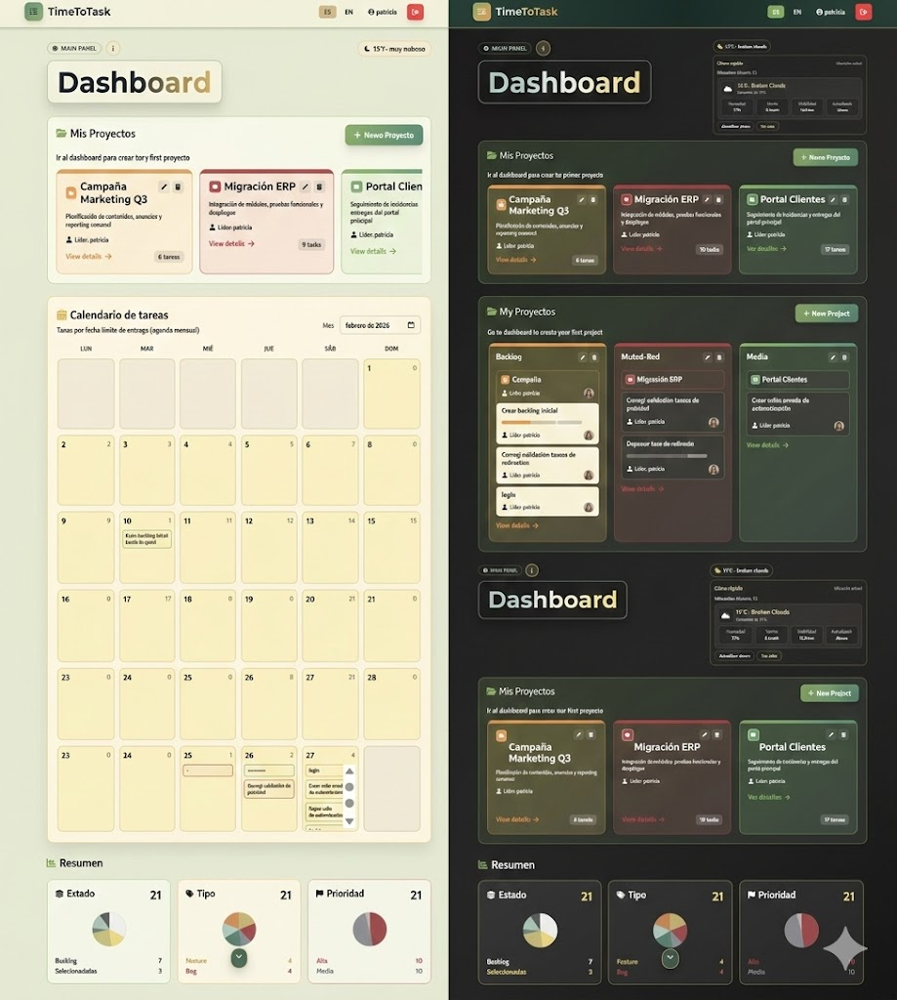
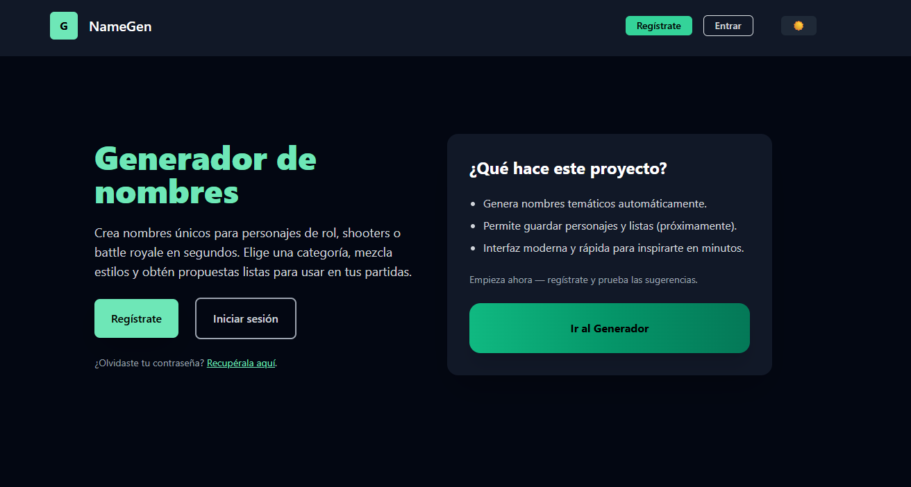

## 👩‍💻 Patricia Alvarez — Full Stack Developer

**Full Stack Developer | Teaching Assistant at 4Geeks Academy | Open to Work**

🔗 **LinkedIn:**
https://www.linkedin.com/in/patricia-alvarez-1052bb332/

📩 **Email:**
[patriciaalvarezestevez@gmail.com](mailto:patriciaalvarezestevez@gmail.com)

---

## 🌐 Portfolio

🚀 My portfolio is live and available online.

🔗 **Live Demo**
https://portfoliopatriciaales202603.onrender.com/

💻 **Repository**
https://github.com/PatriciaAlEs/PortfolioPatriciaAlEs2025

**Tech Stack**
React · Vite · Flask · SQLAlchemy · PostgreSQL · JWT · Python · JavaScript  · Tailwind

Personal portfolio showcasing my projects, experience and background as a **Full Stack Developer**.
Includes bilingual content (ES/EN), authentication, protected sections and responsive design.

  

---

## 👋 About Me

Full Stack Developer and **Teaching Assistant at 4Geeks Academy**.

I build modern web applications using **React, Flask, SQLAlchemy and PostgreSQL**, and I enjoy helping others learn programming through mentoring and technical guidance.

💡 Interested in:

* Full Stack development
* Developer education
* Building useful products

📍 Based in Spain | **Open to work**

🇪🇸 Spanish version available in my portfolio.

---

## 💼 What I Bring

✔ Full stack development experience (**React + Flask**)
✔ Experience mentoring and teaching programming
✔ Building and deploying full stack applications
✔ Working with **REST APIs and authentication systems**
✔ Collaborative development using **Git and GitHub**

---

## 🛠️ Tech Stack

| Languages & Frameworks | Databases | Tools & Others |
|-------------------------|-----------|----------------|
| JavaScript · TypeScript · Python · React · Flask · TailwindCSS | PostgreSQL · MySQL · SQLite | Node.js · Vite · Git · GitHub · SQLAlchemy · REST API |
---

## 👩‍🏫 Teaching & Mentoring

As a **Teaching Assistant at 4Geeks Academy**, I mentor students learning web development and help them understand core programming concepts.

I also created additional repositories used during mentoring sessions, including:

* **Magic Card Form** — controlled inputs and React state management
* **Shopping List** — working with `useState` and `useEffect`
* **Fetching Wizards** — API consumption using `fetch`, `async/await` and REST methods

These repositories provide **alternative explanations and extra practice exercises** to reinforce the bootcamp curriculum.

---

## 🚀 Projects That Showcase My Work

### ⏰ TimeToTask — Full Stack Task Manager

Full stack task and project management application built with **React and Flask**.

  

**Tech**

React · Vite · Tailwind · Flask · SQLAlchemy · PostgreSQL · JWT · REST API

**Key Features**

* JWT authentication
* Project & task management
* Kanban workflow
* Activity dashboard
* Internationalization (ES/EN)

🔗 Repo
https://github.com/PatriciaAlEs/TimeToTask

---

### ✨ Espectra — Modern Frontend Experience

🌐 Live Demo
https://espectra-web.vercel.app/

🔗 Repository
https://github.com/PatriciaAlEs/espectra-web

Frontend project focused on building a **modern visual experience using motion design and scalable component architecture**.

  

**Tech**

React · TypeScript · Vite · Tailwind CSS · Framer Motion · EmailJS

---

### 🧠 Name Generator — React + Flask

🔗 Repo
https://github.com/PatriciaAlEs/PatriciaAlEs-generador-nombres

Full-stack template that generates random names using a **React frontend and Flask backend API**.

  

A base project for building interactive applications with **React + Flask architecture**.

---

## 📚 Other Projects

📖 **Hooboo**
https://github.com/PatriciaAlEs/hooboo
Full stack project to manage books, authors and reading lists.

🌱 **Habit Tracker**
https://github.com/PatriciaAlEs/habit-tracker
Application for tracking daily habits.

🛍️ **Entusiasmao**
https://github.com/PatriciaAlEs/entusiasmao
E-commerce website built with **WordPress and WooCommerce**.

---

## 📈 GitHub Activity

---

## ✨ Fun Facts

* 📚 Fan of **fantasy literature** and tech communities
* 🐱 I have several cats who are my coding companions
* 📖 First book I read in English: *Legends & Lattes*

---

  

